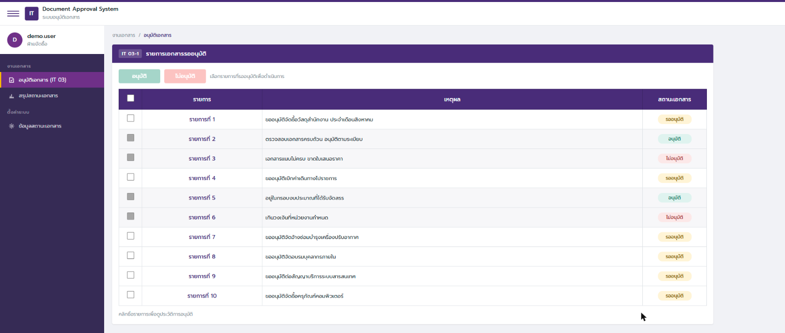
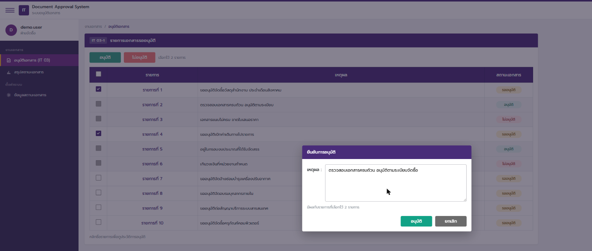
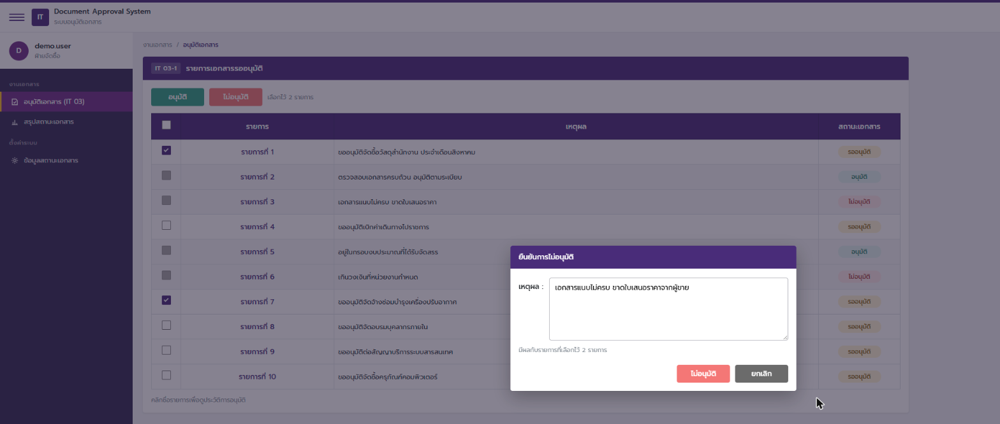
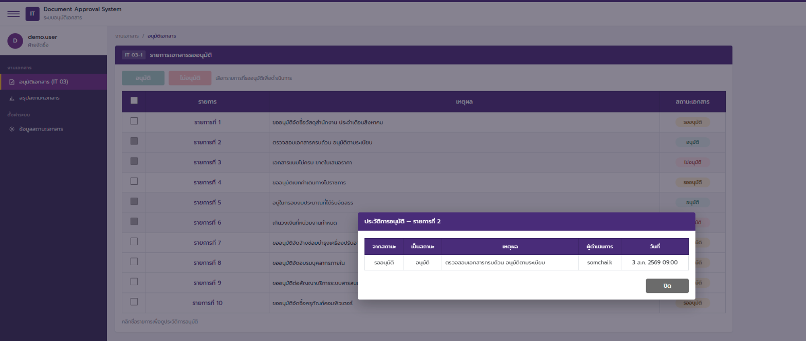
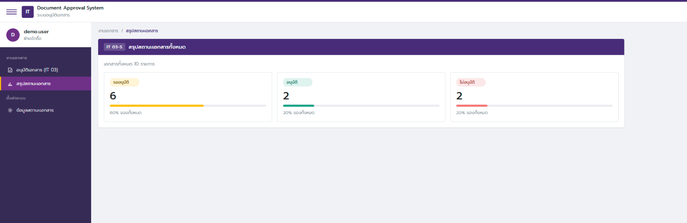
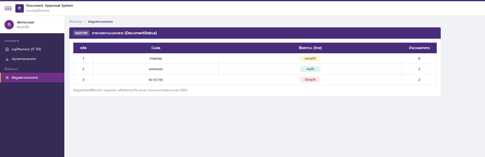

# IT 03 — ระบบอนุมัติเอกสาร (Document Approval System)

แบบทดสอบข้อ 3: หน้าจออนุมัติเอกสาร IT 03-1 / IT 03-2 / IT 03-3

สร้างด้วย **.NET 10** (Clean Architecture + MediatR) และ **Angular 22** (standalone components + signals)
ฐานข้อมูล **SQLite** ผ่าน EF Core

---

## หน้าจอ

### IT 03-1 — รายการเอกสาร

รายการที่ `อนุมัติ` หรือ `ไม่อนุมัติ` แล้ว checkbox จะเป็นสีเทาและเลือกไม่ได้
ปุ่มด้านบนจะกดไม่ได้จนกว่าจะเลือกรายการ



### IT 03-2 — ยืนยันการอนุมัติ



### IT 03-3 — ยืนยันการไม่อนุมัติ



### ประวัติการอนุมัติ

คลิกชื่อรายการเพื่อดูว่าเอกสารเปลี่ยนสถานะมาอย่างไร ใครทำ เมื่อไร ด้วยเหตุผลอะไร



### หน้าอื่นในเมนู

| สรุปสถานะเอกสาร | ข้อมูลสถานะเอกสาร |
|---|---|
|  |  |

---

## วิธีรัน

ต้องมี **.NET SDK 10** และ **Node.js 22.22+ หรือ 24.15+** (ข้อกำหนดของ Angular 22)

### 1. Backend

```bash
dotnet run --project src/Api
```

เปิดที่ `http://localhost:5000` — Swagger UI อยู่ที่ `http://localhost:5000/swagger`

ฐานข้อมูลสร้างและใส่ข้อมูล mockup ให้อัตโนมัติตอนเริ่มทำงาน **ไม่ต้องตั้งค่าอะไรเพิ่ม**

### 2. Frontend

```bash
cd web
npm install
npm start
```

เปิดที่ `http://localhost:4200`

### 3. รันเทส

```bash
dotnet test
```

---

## ดูข้อมูลในตาราง

เปิดดูได้ 3 ทาง ไม่ต้องติดตั้ง database server

| วิธี | ไฟล์ |
|---|---|
| เปิดด้วย DB Browser for SQLite หรือ VS Code extension | `db/app.db` |
| อ่านโครงสร้างตารางเป็น SQL | `db/schema.sql` |
| อ่านข้อมูล mockup เป็น SQL | `db/seed.sql` |

### โครงสร้างตาราง

| ตาราง | หน้าที่ |
|---|---|
| `documents` | เอกสาร: ชื่อ, เหตุผลปัจจุบัน, สถานะ |
| `document_status` | ตารางหลัก 3 สถานะ: `1 PENDING`, `2 APPROVED`, `3 REJECTED` |
| `approval_log` | ประวัติการเปลี่ยนสถานะทุกครั้ง: จากสถานะไหน เป็นสถานะไหน เหตุผล ใคร เมื่อไร |

ทุกตารางมีคอลัมน์ audit ชุดเดียวกัน `created_by` / `created_date` / `created_program` และ
`updated_by` / `updated_date` / `updated_program` ตามมาตรฐานฐานข้อมูลของระบบ
รายละเอียดอยู่ที่ [`docs/design/02-database.md`](docs/design/02-database.md)

ข้อมูล mockup มี 10 รายการตรงตามภาพในข้อสอบ (รายการที่ 2, 5 อนุมัติแล้ว / 3, 6 ไม่อนุมัติ / ที่เหลือรออนุมัติ)

---

## ข้อกำหนดจากข้อสอบ เทียบกับสิ่งที่ทำ

| ข้อกำหนด | ทำที่ไหน |
|---|---|
| หน้า IT 03-1 แสดง 3 สถานะ | `web/src/app/features/it03/it03-page.*` |
| อนุมัติแล้วเลือกอนุมัติซ้ำไม่ได้ | `Document.ChangeStatus()` ใน `src/Domain/Entities/Document.cs` และ checkbox `disabled` ในหน้าจอ |
| กดอนุมัติ → Modal IT 03-2 กรอกเหตุผล → อัปเดตสถานะ | `approval-dialog.*` → `POST /api/it03/documents/approve` |
| กดไม่อนุมัติ → Modal IT 03-3 กรอกเหตุผล → อัปเดตสถานะ | component เดียวกัน → `POST /api/it03/documents/reject` |
| ปุ่มยกเลิกปิด Modal ไม่บันทึก | `(cancelled)` ใน `approval-dialog.ts` |
| ข้อมูลในฐานข้อมูลเป็น mockup | `src/Infrastructure/Persistence/AppDbContextSeeder.cs` |

กฎ "อนุมัติแล้วห้ามอนุมัติซ้ำ" บังคับสองชั้น — หน้าจอปิด checkbox ไม่ให้เลือก และฝั่ง server
โยน `BusinessRuleException` ตอบกลับ HTTP 409 หากมีการเรียก API ตรง

---

## API

| Method | Route | หน้าที่ |
|---|---|---|
| GET | `/api/it03/documents` | รายการเอกสารทั้งหมด |
| POST | `/api/it03/documents/approve` | อนุมัติหลายรายการพร้อมกัน |
| POST | `/api/it03/documents/reject` | ไม่อนุมัติหลายรายการพร้อมกัน |
| GET | `/api/it03/documents/{id}/logs` | ประวัติการอนุมัติของเอกสาร |
| GET | `/api/it03/statuses` | ตารางสถานะเอกสาร |

`approve` และ `reject` รับ `documentIds` เป็น array เพราะหน้าจอเลือกได้หลายรายการ
ทำงานใน transaction เดียว ถ้ามีรายการใดผิดกฎจะยกเลิกทั้งชุด

error ทุกแบบตอบเป็น `ProblemDetails` (RFC 7807): `400` ข้อมูลไม่ถูกต้อง, `404` ไม่พบเอกสาร,
`409` ผิดกฎธุรกิจ

---

## โครงสร้างโปรเจ็ค

```
src/
  Domain/           entity และกฎธุรกิจ ไม่ depend อะไรเลย
  Application/      MediatR handler หนึ่งไฟล์ต่อหนึ่ง use case, validator, DTO
  Infrastructure/   EF Core, SQLite, seeder
  Api/              controller, middleware, Swagger
tests/
  Domain.Tests/     11 เคส ครอบกฎห้ามดำเนินการซ้ำ
web/                Angular 22
db/                 ไฟล์ฐานข้อมูลและ SQL script
docs/               เอกสารออกแบบ
```

Controller ไม่มี business logic เลย ส่ง message เข้า MediatR แล้ว pipeline จัดการ

```
Controller → IMediator → ValidationBehaviour → TransactionBehaviour → Handler → Domain
```

`TransactionBehaviour` เปิด transaction ให้เฉพาะ request ที่เป็น `ICommand` ส่วน query ผ่านไปเลย

---

## เอกสารออกแบบ

เขียนก่อนลงมือเขียนโค้ด บันทึกว่าตัดสินใจอะไรและเพราะอะไร รวมทางเลือกที่ไม่ได้เลือก

- [00 — โจทย์และการตีความ](docs/design/00-requirements.md)
- [01 — สถาปัตยกรรม](docs/design/01-architecture.md)
- [02 — ฐานข้อมูล](docs/design/02-database.md)
- [03 — API](docs/design/03-api.md)
- [04 — UI/UX](docs/design/04-ui-ux.md)
- [05 — บันทึกการตัดสินใจ](docs/design/05-decisions.md)

จุดที่ควรอ่านคือ [00 — โจทย์และการตีความ](docs/design/00-requirements.md) ซึ่งอธิบายสามเรื่อง
ที่อ่านได้จากภาพแต่ไม่ได้เขียนไว้ในโจทย์: การทำงานเป็นแบบเลือกหลายรายการ, checkbox ของแถวที่
ตัดสินแล้วเป็นสีเทา, และคอลัมน์ `เหตุผล` มีค่าในแถวที่ยังรออนุมัติด้วย
