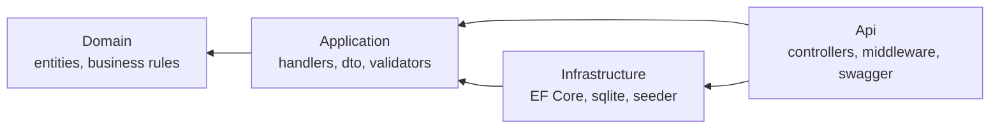
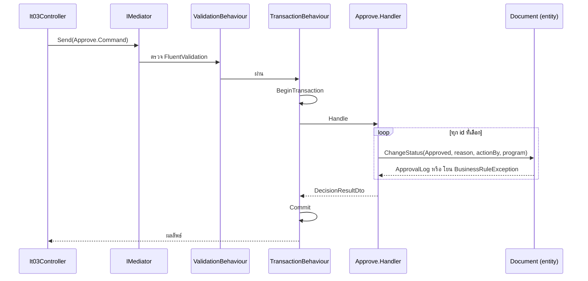

# 01 — สถาปัตยกรรม

## เป้าหมาย

โจทย์ไม่ซับซ้อน แต่ต้องการให้เห็นว่าวางโครงงานระดับองค์กรได้ สิ่งที่ต้องเห็นคือ
มี **ตัวกลาง** ระหว่าง controller กับ business logic, กฎธุรกิจอยู่ที่เดียว, และเทสได้

## 4 ชั้น



ทิศทางการพึ่งพาชี้เข้าด้านในเสมอ `Domain` ไม่อ้างอิงอะไรเลย แม้แต่ EF Core
`Application` ประกาศ interface ที่ตัวเองต้องใช้ (`IAppDbContext`, `ICurrentUserAccessor`)
แล้ว `Infrastructure` กับ `Api` เป็นฝ่ายไปทำให้เกิดจริง

| โครงการ | หน้าที่ | ห้ามรู้จัก |
|---|---|---|
| `Domain` | entity และกฎธุรกิจ | ทุกอย่าง |
| `Application` | use case หนึ่งไฟล์หนึ่งงาน | HTTP, EF provider |
| `Infrastructure` | DbContext, mapping, seed | HTTP |
| `Api` | controller, middleware, DI | รายละเอียด SQL |

## ตัวกลาง: MediatR

Controller ไม่เรียก service ตรง ไม่รู้จัก business logic เลย มันแค่ส่ง message เข้า mediator



ถ้ามี exception ระหว่างวน transaction ไม่ commit → ไม่มีเอกสารใดถูกแก้

### Pipeline behaviours

ลำดับสำคัญ ตรวจก่อนเปิด transaction เสมอ

| ลำดับ | Behaviour | ทำอะไร | ใช้กับ |
|---|---|---|---|
| 1 | `ValidationBehaviour` | รวม error จาก FluentValidation แล้วโยนทีเดียว | ทุก request ที่มี validator |
| 2 | `TransactionBehaviour` | เปิด/commit transaction | request ที่ mark ว่าเป็น `ICommand` |

`TransactionBehaviour` แยก command กับ query ด้วย marker interface `ICommand`
query จึงไม่ต้องเสียค่าเปิด transaction เปล่า ๆ

```csharp
if (request is not ICommand || _context.HasActiveTransaction)
    return await next();
```

จุดที่ตั้งใจ: ไม่มี `try/catch` ใน behaviour เพราะการปล่อยให้ exception หลุดออกไปแล้ว
`using` dispose transaction ที่ยังไม่ commit **คือ** การ rollback อยู่แล้ว เขียนเพิ่มไม่ได้ช่วยอะไร

## หนึ่งไฟล์ต่อหนึ่ง use case

```
Application/Features/IT/IT03/
  GetDocumentList.cs        Query + Handler
  Approve.cs                Command + Validator + Handler
  Reject.cs                 Command + Validator + Handler
  GetApprovalHistory.cs     Query + Handler
  Common/
    DocumentDecisionExecutor.cs
  Dtos/
```

รูปแบบนี้ยกมาจากโครงสร้าง `Application/Features/DC/DCDT01/` ของ SLCM ที่แยก
`Approve.cs`, `Cancel.cs`, `Create.cs` เป็นไฟล์ละงาน อ่านง่ายและหาของเจอเร็วเมื่อ feature โตขึ้น

`Approve` กับ `Reject` ต่างกันแค่สถานะเป้าหมาย งานที่เหมือนกันจึงอยู่ใน
`DocumentDecisionExecutor` ตัวเดียว ไม่ก๊อปโค้ดสองรอบ แต่ยังคงมี entry point แยกชื่อชัดเจน

## กฎธุรกิจอยู่ใน Domain

หัวใจของข้อสอบคือ "อนุมัติแล้วห้ามอนุมัติซ้ำ" กฎนี้อยู่บน entity

```csharp
public ApprovalLog ChangeStatus(
    DocumentStatusCode toStatus, string reason, string actionBy, string program, DateTime now)
{
    if (!IsPending)
        throw new BusinessRuleException($"เอกสาร '{DocumentName}' มีสถานะ '...' อยู่แล้ว ...");
    ...
}
```

เหตุผลที่ไม่เอาไว้ใน controller หรือใน UI

1. UI ปิด checkbox ได้ แต่ใครยิง API ตรงก็ข้ามได้ กฎต้องอยู่ฝั่ง server
2. เทสได้โดยไม่ต้องมี database เลย — 11 เคสใน `Domain.Tests` รันเสร็จใน 220ms
3. ถ้าเพิ่มช่องทางใหม่ (import, batch job) กฎยังบังคับใช้เองอัตโนมัติ

## การจัดการ error

`ExceptionHandlingMiddleware` แปลง exception เป็น `ProblemDetails` (RFC 7807)

| Exception | HTTP | ความหมาย |
|---|---|---|
| `ValidationException` | 400 | ข้อมูลที่ส่งมาไม่ถูกต้อง |
| `NotFoundException` | 404 | ไม่พบเอกสาร |
| `BusinessRuleException` | 409 | ผิดกฎธุรกิจ เช่นอนุมัติซ้ำ |
| อื่น ๆ | 500 | log ไว้ ไม่ส่งรายละเอียดออกไป |

409 คือจุดสำคัญ การอนุมัติซ้ำไม่ใช่ bug ของ server จึงต้องไม่เป็น 500
