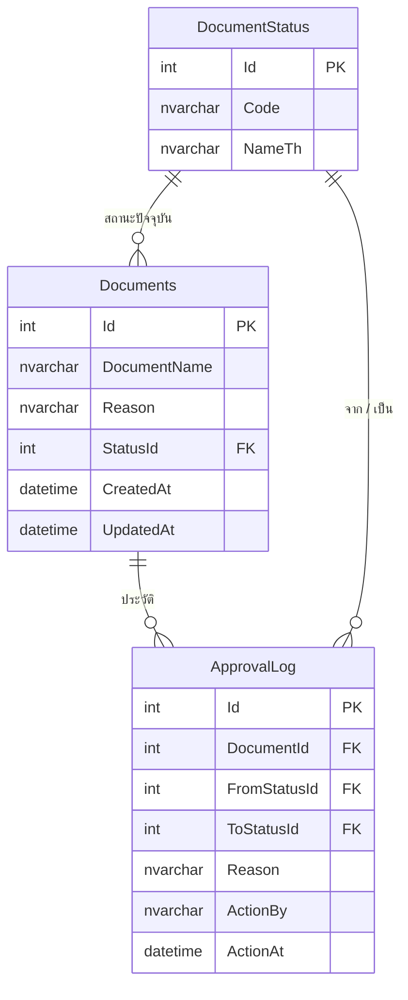

# 02 — ฐานข้อมูล

## เลือกอะไร และเพราะอะไร

ข้อกำหนดที่ตั้งไว้: **คนตรวจต้องเปิดดูตารางได้ง่ายที่สุด** โดยไม่ต้องติดตั้งอะไร

| ตัวเลือก | ข้อดี | ข้อเสีย | สรุป |
|---|---|---|---|
| **SQLite** | ไฟล์เดียว `dotnet run` ทำงานทันที เปิดดูด้วย DB Browser หรือ VS Code extension | ไม่ใช่ enterprise DB | **เลือก** |
| SQL Server LocalDB | คนตรวจสาย .NET คุ้นเคย ดูผ่าน SSMS | ต้องมี LocalDB ติดตั้งอยู่ ถ้าไม่มีรันไม่ได้ | ไม่เลือก |
| SQL Server ใน Docker | ครบเครื่อง | ต้องมี Docker และ pull image ~1.5GB | ไม่เลือก |
| PostgreSQL | ฟรี ครบ | ต้องติดตั้ง server และเครื่องมือดูตารางเพิ่ม | ไม่เลือก |

SQLite ชนะเพราะทำให้ระยะห่างระหว่าง `git clone` กับ "เห็นข้อมูลในตาราง" สั้นที่สุด

ส่งมอบสามทางเพื่อให้ดูข้อมูลได้ไม่ว่าจะรันโปรแกรมหรือไม่

1. `db/app.db` — เปิดด้วย DB Browser for SQLite ได้เลย
2. `db/schema.sql` — อ่านโครงสร้างบน GitHub ได้โดยไม่ต้องดาวน์โหลด
3. `db/seed.sql` — อ่านข้อมูล mockup ได้เป็นข้อความ

การเข้าถึงผ่าน EF Core ทั้งหมด การย้ายไป SQL Server จริงคือเปลี่ยน `UseSqlite` เป็น
`UseSqlServer` และสร้าง migration ใหม่ ไม่มี SQL ดิบผูกกับ provider อยู่ในโค้ด

## โครงสร้าง

### DocumentStatus (ตารางหลัก)

| Id | Code | NameTh |
|---|---|---|
| 1 | PENDING | รออนุมัติ |
| 2 | APPROVED | อนุมัติ |
| 3 | REJECTED | ไม่อนุมัติ |

เก็บเป็นตารางแยกไม่ใช่ string ในตาราง Documents เพราะเป็นข้อมูลหลักที่มีรหัสตายตัว
และทำให้เพิ่มสถานะใหม่ไม่ต้องแก้โครงสร้าง

`Id` ต้องตรงกับ enum `DocumentStatusCode` ในโค้ด จึงตั้ง `ValueGeneratedNever()`
และฝังไปกับ migration ผ่าน `HasData` ไม่ใช่ seeder ตอน runtime

### Documents

`Reason` เป็นค่าที่ **denormalise ไว้ตั้งใจ** เก็บเหตุผลปัจจุบันของเอกสาร

เหตุผล: ภาพ IT 03-1 แสดงเหตุผลในทุกแถวรวมแถวที่ยังรออนุมัติ ซึ่งยังไม่มีประวัติการอนุมัติ
ถ้าดึงจาก `ApprovalLog` ล่าสุดเสมอ แถวรออนุมัติจะว่าง ไม่ตรงภาพ

การแลก: มีข้อมูลซ้ำสองที่ ชดเชยด้วยการเขียนทั้งสองที่ในคำสั่งเดียวกันภายใน transaction
เดียวกัน (`Document.ChangeStatus`) จึงไม่มีทางไม่ตรงกัน และได้ผลพลอยได้คือ
query หน้าตารางเป็นการอ่านตารางเดียว ไม่ต้อง join หา log ล่าสุด

### ApprovalLog

เป็น append-only ไม่มีการ update หรือ delete เก็บ `FromStatusId` และ `ToStatusId`
ทั้งคู่ ไม่ใช่แค่สถานะปลายทาง เพื่อให้ตอบได้ว่าเอกสารเดินทางมาอย่างไร

`ActionBy` มาจาก `ICurrentUserAccessor` ซึ่งอ่าน header `X-User` ถ้าไม่ส่งมาใช้ `demo.user`

FK สามตัวจึงมี `DeleteBehavior`

| ความสัมพันธ์ | พฤติกรรม | เหตุผล |
|---|---|---|
| `ApprovalLog` → `Documents` | Cascade | ลบเอกสารแล้วประวัติไม่ควรลอย |
| `ApprovalLog` → `DocumentStatus` | Restrict | ห้ามลบสถานะที่มีประวัติอ้างอยู่ |
| `Documents` → `DocumentStatus` | Restrict | ห้ามลบสถานะที่มีเอกสารใช้อยู่ |

### Index

- `Documents.StatusId` — หน้าตารางกรองและเรียงตามสถานะ
- `ApprovalLog.DocumentId` — ดึงประวัติของเอกสารหนึ่งใบ
- `DocumentStatus.Code` unique — กันรหัสซ้ำ

## ข้อมูล mockup

10 รายการตรงตามภาพ IT 03-1

| แถว | สถานะ | มี ApprovalLog |
|---|---|---|
| 1, 4, 7, 8, 9, 10 | รออนุมัติ | ไม่มี |
| 2, 5 | อนุมัติ | มี |
| 3, 6 | ไม่อนุมัติ | มี |

แถวที่ตัดสินแล้วได้ `ApprovalLog` ติดมาด้วย เพื่อให้หน้าประวัติมีข้อมูลให้ดูตั้งแต่รันครั้งแรก
ไม่ใช่ตารางเปล่า

วันที่ใน seed เป็นค่าคงที่ ไม่ใช่ `DateTime.Now` เพื่อให้สร้างไฟล์ฐานข้อมูลใหม่แล้วได้ผลเหมือนเดิม

seeder จะไม่ทำอะไรถ้ามีข้อมูลอยู่แล้ว จึงรันซ้ำได้ปลอดภัย
