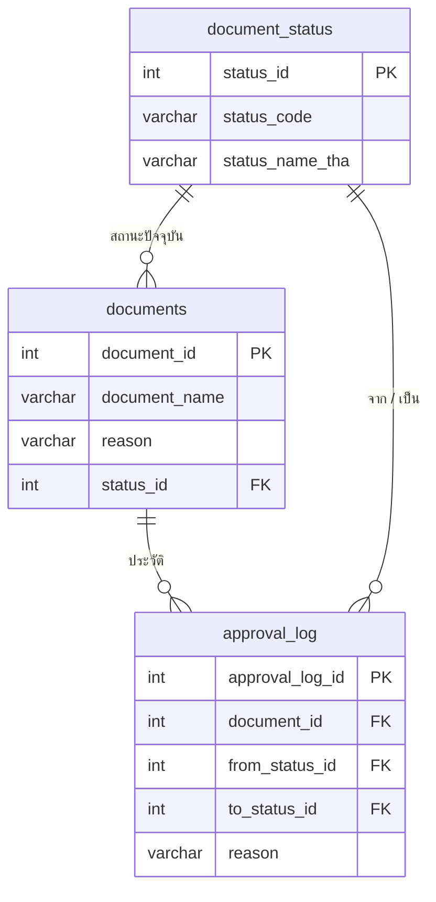

# 02 — ฐานข้อมูล

## เลือกอะไร และเพราะอะไร

ข้อกำหนดที่ตั้งไว้: **คนตรวจต้องเปิดดูตารางได้ง่ายที่สุด** โดยไม่ต้องติดตั้งอะไร

| ตัวเลือก | ข้อดี | ข้อเสีย | สรุป |
|---|---|---|---|
| **SQLite** | ไฟล์เดียว `dotnet run` ทำงานทันที เปิดดูด้วย DB Browser หรือ VS Code extension | ไม่ใช่ enterprise DB | **เลือก** |
| SQL Server LocalDB | คนตรวจสาย .NET คุ้นเคย ดูผ่าน SSMS | ต้องมี LocalDB ติดตั้งอยู่ ถ้าไม่มีรันไม่ได้ | ไม่เลือก |
| SQL Server ใน Docker | ครบเครื่อง | ต้องมี Docker และ pull image ~1.5GB | ไม่เลือก |
| PostgreSQL | ฟรี ครบ | ต้องติดตั้ง server และเครื่องมือดูตารางเพิ่ม | ไม่เลือก |

SQLite ชนะเพราะทำให้ระยะห่างระหว่าง `git clone` กับ "เห็นข้อมูลในตาราง" สั้นที่สุด

ส่งมอบสามทางเพื่อให้ดูข้อมูลได้ไม่ว่าจะรันโปรแกรมหรือไม่

1. `db/app.db` — เปิดด้วย DB Browser for SQLite ได้เลย
2. `db/schema.sql` — อ่านโครงสร้างบน GitHub ได้โดยไม่ต้องดาวน์โหลด
3. `db/seed.sql` — อ่านข้อมูล mockup ได้เป็นข้อความ

การเข้าถึงผ่าน EF Core ทั้งหมด การย้ายไป SQL Server จริงคือเปลี่ยน `UseSqlite` เป็น
`UseSqlServer` และสร้าง migration ใหม่ ไม่มี SQL ดิบผูกกับ provider อยู่ในโค้ด

## โครงสร้าง

ชื่อตารางและคอลัมน์เป็น `snake_case` ตามมาตรฐานฐานข้อมูลระดับองค์กร ส่วน property ในโค้ด C#
ยังเป็น PascalCase ตามภาษา เชื่อมกันด้วย `HasColumnName` ใน configuration

ทุกตารางมีคอลัมน์ audit ชุดเดียวกันอีก 6 ตัว แยกไว้ในหัวข้อถัดไปเพื่อไม่ให้ ER diagram รก

### คอลัมน์ audit (ทุกตาราง)

| คอลัมน์ | ชนิด | ความหมาย |
|---|---|---|
| `created_by` | varchar(50) NOT NULL | รหัสผู้ใช้งานที่สร้างข้อมูล |
| `created_date` | timestamp NOT NULL | วันเวลาที่สร้างข้อมูล |
| `created_program` | varchar(50) NOT NULL | รหัสโปรแกรมที่สร้างข้อมูล |
| `updated_by` | varchar(50) NOT NULL | รหัสผู้ใช้งานที่ปรับปรุงข้อมูลล่าสุด |
| `updated_date` | timestamp NOT NULL | วันเวลาที่ปรับปรุงข้อมูลล่าสุด |
| `updated_program` | varchar(50) NOT NULL | รหัสโปรแกรมที่ปรับปรุงข้อมูลล่าสุด |

รวมไว้ที่ base class `Domain.Common.AuditableEntity` และผูกชื่อคอลัมน์ครั้งเดียวที่
`AuditColumnConfiguration.HasAuditColumns()` ทั้งสามตารางจึงได้ชุดเดียวกันโดยไม่เขียนซ้ำ

การเติมค่าเกิดที่ `AppDbContext.SaveChangesAsync` แถวที่เพิ่มใหม่และยังไม่มี `created_by`
จะถูกประทับให้อัตโนมัติ ส่วนแถวที่แก้ไขจะได้ `updated_*` ชุดใหม่เสมอ
แถวที่ตั้งค่ามาเองไว้แล้วจะไม่ถูกทับ เพราะ seeder ตั้งใจย้อนวันที่ให้ประวัติดูสมจริง

`created_program` / `updated_program` เก็บ **รหัสหน้าจอ** เช่น `IT03` มาจาก
`ICurrentUserAccessor.ProgramCode` ซึ่งอ่าน header `X-Program` ถ้าไม่ส่งมาใช้ `IT03`
ข้อมูลที่มากับ seeder ใช้ `SYSTEM` / `SEED` เพื่อแยกให้ออกว่าไม่ได้เกิดจากคนกดหน้าจอ

### document_status (ตารางหลัก)

| status_id | status_code | status_name_tha |
|---|---|---|
| 1 | PENDING | รออนุมัติ |
| 2 | APPROVED | อนุมัติ |
| 3 | REJECTED | ไม่อนุมัติ |

เก็บเป็นตารางแยกไม่ใช่ string ในตาราง `documents` เพราะเป็นข้อมูลหลักที่มีรหัสตายตัว
และทำให้เพิ่มสถานะใหม่ไม่ต้องแก้โครงสร้าง

`status_id` ต้องตรงกับ enum `DocumentStatusCode` ในโค้ด จึงตั้ง `ValueGeneratedNever()`
และฝังไปกับ migration ผ่าน `HasData` ไม่ใช่ seeder ตอน runtime — ค่า audit ของสามแถวนี้
จึงต้องเป็นค่าคงที่ ไม่ใช่ `DateTime.UtcNow` ไม่งั้น migration จะเปลี่ยนทุกครั้งที่ scaffold

### documents

`reason` เป็นค่าที่ **denormalise ไว้ตั้งใจ** เก็บเหตุผลปัจจุบันของเอกสาร

เหตุผล: ภาพ IT 03-1 แสดงเหตุผลในทุกแถวรวมแถวที่ยังรออนุมัติ ซึ่งยังไม่มีประวัติการอนุมัติ
ถ้าดึงจาก `ApprovalLog` ล่าสุดเสมอ แถวรออนุมัติจะว่าง ไม่ตรงภาพ

การแลก: มีข้อมูลซ้ำสองที่ ชดเชยด้วยการเขียนทั้งสองที่ในคำสั่งเดียวกันภายใน transaction
เดียวกัน (`Document.ChangeStatus`) จึงไม่มีทางไม่ตรงกัน และได้ผลพลอยได้คือ
query หน้าตารางเป็นการอ่านตารางเดียว ไม่ต้อง join หา log ล่าสุด

### approval_log

เป็น append-only ไม่มีการ update หรือ delete เก็บ `from_status_id` และ `to_status_id`
ทั้งคู่ ไม่ใช่แค่สถานะปลายทาง เพื่อให้ตอบได้ว่าเอกสารเดินทางมาอย่างไร

ตารางนี้ไม่มีคอลัมน์ "ผู้ดำเนินการ" แยกต่างหาก เพราะแถวถูกเขียนครั้งเดียวแล้วไม่แก้อีก
`created_by` กับ `created_date` จึง**คือ**คนที่กดอนุมัติและเวลาที่กด ไม่ใช่ข้อมูลซ้ำซ้อน
ค่ามาจาก `ICurrentUserAccessor` ซึ่งอ่าน header `X-User` ถ้าไม่ส่งมาใช้ `demo.user`

FK สามตัวจึงมี `DeleteBehavior`

| ความสัมพันธ์ | พฤติกรรม | เหตุผล |
|---|---|---|
| `approval_log` → `documents` | Cascade | ลบเอกสารแล้วประวัติไม่ควรลอย |
| `approval_log` → `document_status` | Restrict | ห้ามลบสถานะที่มีประวัติอ้างอยู่ |
| `documents` → `document_status` | Restrict | ห้ามลบสถานะที่มีเอกสารใช้อยู่ |

### Index

- `documents.status_id` — หน้าตารางกรองและเรียงตามสถานะ
- `approval_log.document_id` — ดึงประวัติของเอกสารหนึ่งใบ
- `document_status.status_code` unique — กันรหัสซ้ำ

## ข้อมูล mockup

10 รายการตรงตามภาพ IT 03-1

| แถว | สถานะ | มี ApprovalLog |
|---|---|---|
| 1, 4, 7, 8, 9, 10 | รออนุมัติ | ไม่มี |
| 2, 5 | อนุมัติ | มี |
| 3, 6 | ไม่อนุมัติ | มี |

แถวที่ตัดสินแล้วได้ `ApprovalLog` ติดมาด้วย เพื่อให้หน้าประวัติมีข้อมูลให้ดูตั้งแต่รันครั้งแรก
ไม่ใช่ตารางเปล่า

วันที่ใน seed เป็นค่าคงที่ ไม่ใช่ `DateTime.Now` เพื่อให้สร้างไฟล์ฐานข้อมูลใหม่แล้วได้ผลเหมือนเดิม

seeder จะไม่ทำอะไรถ้ามีข้อมูลอยู่แล้ว จึงรันซ้ำได้ปลอดภัย
